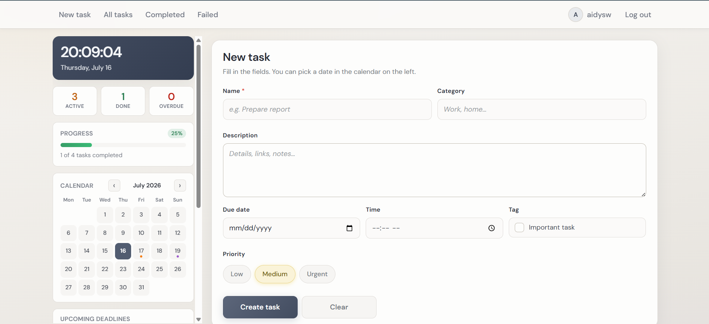
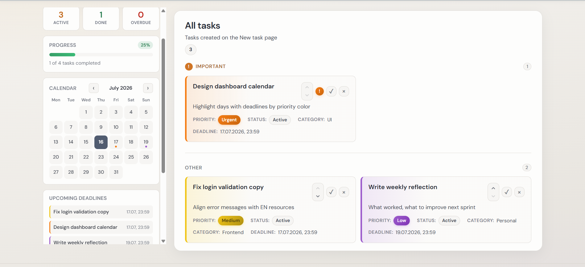
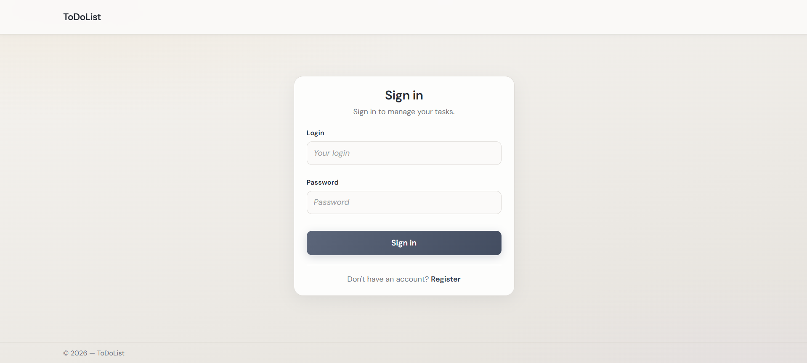

# ToDoList

A personal task management web app built with ASP.NET Core.

Create tasks with priorities and deadlines, track progress on a dashboard, reorder active items, and get real-time deadline reminders while you're online.

---

## Features

- **Authentication** — registration and login with cookie-based auth; passwords are hashed
- **Task management** — title, description, category, priority, importance flag, optional deadline
- **Statuses** — In Progress, Done, and Failed (overdue tasks are marked automatically)
- **Task lists** — separate views for active, completed, and overdue tasks
- **Filtering & sorting** — by category, priority, search text, and sort fields
- **Manual ordering** — move active tasks up/down within importance zones
- **Dashboard** — stats, completion progress, upcoming deadlines, interactive calendar
- **Real-time reminders** — SignalR toasts 24 hours and 1 hour before a deadline
- **Profile** — avatar upload and UI language switch (English / Russian)
- **Localization** — resource-based UI strings with culture middleware

---

## Tech stack

| Layer | Technologies |
|------|----------------|
| Backend | ASP.NET Core MVC 8, Cookie Authentication |
| Data | Entity Framework Core 8, SQL Server (LocalDB) |
| Real-time | SignalR |
| Frontend | Razor Views, Bootstrap, jQuery, vanilla JavaScript |
| i18n | `.resx` resources + custom localization middleware |

---

## Architecture

The solution is split into two projects:

```
ToDoList.slnx
├── ToDoList          # Web app: controllers, services, views, hubs, static assets
└── ToDoList.Data     # Data layer: models, DbContext, repositories, migrations
```

Request flow:

```
Controller → Service → Repository → EF Core / SQL Server
```

Notable pieces:
- **BackgroundService** — polls deadlines and sends SignalR reminders
- **Dashboard ViewComponent** — aggregates stats and calendar data
- **API endpoints** — login availability check and task reordering

---

## Prerequisites

- [.NET 8 SDK](https://dotnet.microsoft.com/download/dotnet/8.0)
- SQL Server LocalDB (included with Visual Studio) or SQL Server
- Optional: Visual Studio 2022, VS Code, or Rider

---

## Getting started

### 1. Clone the repository

```bash
git clone https://github.com/sleepaidy/ToDoList.git
cd ToDoList
```

### 2. Configure the connection string

Edit `ToDoList/appsettings.json` if needed:

```json
"ConnectionStrings": {
  "DefaultDbConnection": "Data Source=(localdb)\\MSSQLLocalDB;Initial Catalog=ToDoList;Integrated Security=True;Connect Timeout=30;"
}
```

### 3. Apply database migrations

From the solution root:

```bash
dotnet ef database update --project ToDoList.Data --startup-project ToDoList.Data
```

> Requires the EF Core tools:  
> `dotnet tool install --global dotnet-ef`

### 4. Run the app

```bash
dotnet run --project ToDoList/ToDoList.csproj
```

Open the HTTPS URL printed in the console (typically `https://localhost:7xxx`).

---

## Project structure

```
ToDoList/
├── Controllers/           # MVC + API controllers
├── Services/              # Business logic and background reminders
├── Hubs/                  # SignalR hub and online user tracking
├── Views/                 # Razor templates
├── Localization/          # English / Russian resources
├── wwwroot/js/            # Client scripts
│   ├── site.js            # Dashboard clock and calendar
│   ├── registration.js    # Live username availability check
│   └── todo/
│       ├── task-order.js              # Task reordering UI
│       └── deadline-notifications.js  # SignalR toast notifications
└── Program.cs

ToDoList.Data/
├── Models/
├── Repository/
├── Migrations/
└── WebContext.cs
```

---

## How it works (user flow)

1. **Register / sign in** — usernames are checked for uniqueness via API; avatars are optional.
2. **Create tasks** — set priority, category, importance, and deadline.
3. **Manage the active list** — complete, delete, or reorder items.
4. **Track deadlines** — overdue items move to Failed; online users get in-app reminders.
5. **Profile** — change language or update the avatar.

---

## Screenshots

### Create task
New task form with the sidebar widgets (stats, progress, and calendar).



### Active tasks
Active list with Important / Other zones, priorities, and upcoming deadlines.



### Sign in
Authentication screen.



---

## Security

- Password hashing with ASP.NET Identity `PasswordHasher`
- Authorization on protected pages and APIs
- Per-user task isolation (`userId` scoped queries)
- Avatar upload restricted to common image extensions

---

## License

MIT
